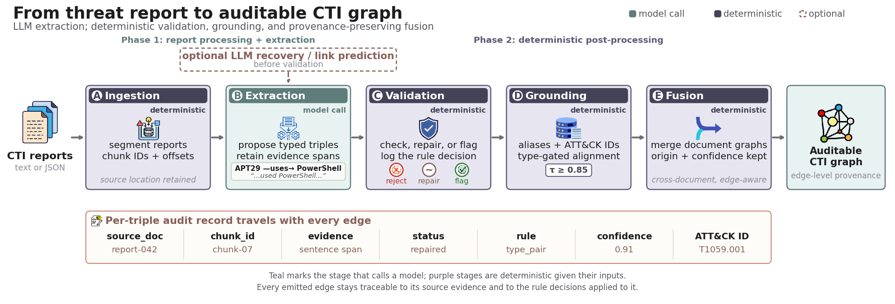

<div align="center">
  <h1>CTIForge</h1>
  <h2>Ranked by the Matcher: A Reproducibility Audit of Knowledge Graph Extraction from Threat Reports</h2>
  <p>
    
    <a href="LICENSE"></a>
  </p>
</div>

---

CTIForge builds cyber-threat-intelligence knowledge graphs from unstructured
reports. An LLM proposes typed triples; deterministic validation, grounding,
and provenance-preserving fusion make the resulting graph inspectable. The
pipeline preserves evidence, records rule decisions, and supports reproducible
evaluation across multiple extraction backbones.

[Architecture](#architecture) · [Quick start](#quick-start) ·
[Reported evaluations](#reproduce-the-reported-evaluations) · [Tests](#tests)

## Architecture

<p align="center">
  
</p>

The five-stage pipeline retains source positions during ingestion, proposes
evidence-linked triples, records deterministic validation decisions, grounds
entities to aliases and ATT&amp;CK identifiers, and preserves origin and
confidence during graph fusion.

## What CTIForge provides

- Evidence-linked typed-triple extraction from text and structured reports.
- Deterministic validation and repair with explicit per-triple actions.
- Alias-aware ATT&amp;CK grounding and provenance-preserving graph fusion.
- Protocol-aware evaluation with document-scoped and pooled scoring.

## Install

```bash
conda create -n cti python=3.11
conda activate cti
pip install -r requirements.txt
cp .env.example .env       # add the provider key needed for extraction
```

The command-line entry point is `python -m src.cli` (or `ctiforge` after an
editable install). Extraction uses LiteLLM and supports hosted and local
backbones. Scoring cached predictions does not require an API key.

## Backends

| Backend | Mode | Included configuration |
|---|---|---|
| OpenAI | Hosted | Default and reported |
| Anthropic | Hosted | Reported |
| OpenRouter | Hosted | Reported |
| Qwen2.5, Mistral, Gemma 2 | Local | Reported |

The exact paper-used presets are versioned under `configs/reported/`.

## Data

The evaluation corpora are third-party and are not included:

- CTI-Nexus: 149 annotated reports ([repository](https://github.com/peng-gao-lab/CTINexus)).
- CTIKG: 255 annotated sentences (use the CTIKG release).
- MITRE ATT&CK records for technique and alias grounding.

Place the files at `data/annotations/ctinexus/` and `data/external/mitre.jsonl`,
or pass the corresponding paths to a benchmark command. GRID calibration data
and prediction caches are also external; the relevant scripts document their
expected locations.

## Quick start

```bash
pytest -q
python -m src.cli --help
python main.py --config configs/default.yaml info
```

To process one report:

```bash
python main.py --config configs/default.yaml \
  extract data/annotations/ctinexus/<report>.json -o output/single
```

## Reproduce the reported evaluations

Paper-used configurations are in `configs/reported/`. Generated files belong
under `output/`, which is intentionally ignored by Git.

| Purpose | Command | Input |
|---|---|---|
| CTI-Nexus metrics | `python -m benchmarks.eval_ctinexus_decomposed --config configs/reported/openai-gpt4o.yaml --max-docs 149 -o output/ctinexus` | CTI-Nexus |
| Shared module ablation | `python -m benchmarks.eval_module_ablation --config configs/reported/openrouter-minimax.yaml --max-docs 149 -o output/ablation` | CTI-Nexus |
| CTIKG comparison | `python -m benchmarks.eval_ctikg_benchmark --config configs/reported/openai-gpt4o.yaml` | CTIKG |
| Protocol sensitivity | `python -m benchmarks.eval_protocol_spread` | cached predictions |
| Matcher/human calibration | `python -m benchmarks.eval_matcher_vs_human` | GRID labels |
| Error taxonomy | `python -m benchmarks.eval_error_taxonomy output/<run>` | a pipeline run |

The module ablation extracts once and derives B, B+C, and B+C+D from the same
triples. This isolates downstream module effects from fresh LLM sampling.

## Scoring notes

- Matching is performed per document; pooled scores are reported separately.
- No model is trained and no data split is learned in this repository.
- Schema-neutral measures (for example, evidence presence and duplicate rate)
  are separated from CTIForge-specific constraint measures.
- `scope: per_document` identifies the comparable score in result JSON files.

## Tests

```bash
pytest -q
```

The suite covers schemas, ingestion, extraction parsing, validation and repair,
canonicalization, per-document scoring, matcher calibration, and evaluation
harnesses.

## Layout

```text
src/                    reusable pipeline implementation
benchmarks/             paper evaluation entry points
configs/                default and reported-run configurations
prompts/                extraction and recovery templates
scripts/                common shell wrappers
tests/                  offline regression tests
```

## Contact

Please open an issue for project questions or contact Safayat Bin Hakim at
`safayat DOT b DOT hakim AT gmail DOT com`.

## License

MIT. The evaluation datasets retain their own licenses and terms.
